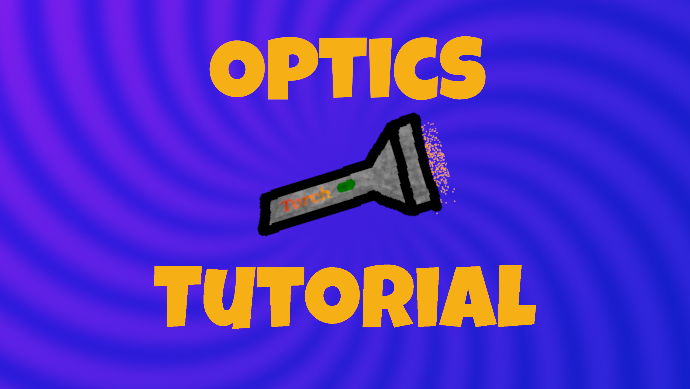
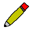
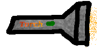
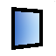
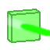
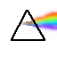
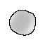

   
# Optics Enhanced
Optics enhanced is fork of [Optics](https://github.com/Hohenzoler/optyka), which has more features.

## Showcase

## New features
* Enhanced look of hotbar
* Disabling Bin
* Movable Camera
* New achievements
* Little optimizations

## Installation
There are two ways to install the project: download exe file, or run the project from source.

> [!NOTE]
> For now the project is only downloadable using second method.

~~### Method 1 ~~
~~1. Go to the ***Releases*** page on our project's GitHub ~~
~~2. Download ***v1.0.zip*** or ***v1.0-onefile.zip*** ~~
~~3. Extract all the files ~~
~~4. Run ***optics.exe*** ~~

### Method 2
1. Clone the repository: `git clone https://github.com/Hohenzoler/optyka.git`
2. Navigate to the project directory: `optyka`
3. Install the required packages: `pip install -r requirements.txt`
4. Run the main script: `python main.py`

## Usage
* Click Start.
* You can choose:
   - new save (nothing is placed)
   - load preset (a premade project made by the developers)
   - one of your saves (if you have any)
* Now you can place objects and see how they interact with each other.
* `Right click` an object to pick it up or release it.
* When holding an object, click `P` to open its parameters window.
 

* Parameters include:
   - position
   - angle relative to horizontal position
   - size relative to original size
   - reflection factor (how much of the light gets reflected)
   - transmittance (how much of the light passes through the object)
   - refraction index (it measures how much light is bend) 
   - color
* When holding an object you can rotate it by scrolling.
* When holding an object you can also press `R` to enter _resizing mode_. 
   - In _resizing mode_ you can resize the object by clicking and dragging one of the points visible on the object.
   - If the object in question is a lens, you can drag the points in the middle to change the lens's curvature radius.
   - If you drag the points a bit farther, the lens can be curved inward. 
   - You can also press `R` again while holding the object to exit _resizing mode_.
* You can delete an object by dragging it to the bin.

* You can enter _drawing mode_ by clicking the icon that looks like this: 

   - While in _drawing mode_ you can draw a new object by clicking different places on screen.
   - You can also delete the last point placed by pressing `Backspace` or move a point by `right clicking`.
   - Then, when `Enter` is pressed, a mirror in the desired shape is added to the environment.
   - It's possible to exit this mode by simply clicking on the icon again.
* Press `Z` to randomize colors of all flashlights.

## Objects and Features:
### The app includes various objects:
 **Flashlight** - produces light that other objects can interact with, can be turned on and off by `Left clicking`.

 **Mirror** - a rectangular object that reflects light.

 

 **Colored glass** - if a beam of light passes through it, the light changes color accordingly to the color of the glass.

 

 **Prism** - a triangular object that disperses and redirects light that enters it.

 

 **Custom-shaped mirror** - it's a regular mirror, but you can draw it so it assumes the desired shape.

 

 **Lens** - magnifies or demagnifies light that enters it.

 

 **Corridor** - Light can enter and exit it from the sides but the two other sides work like mirrors.

 

### The app also includes the following features:
* **Parameters** - Every object has parameters that change the way they interact with the environment.
* **Saving and loading** - you can save your loadout when quitting and come back to it later. You can also delete your saves.
* **Presets** - you can load a premade project (preset) as if you had made it yourself.
* **Picking up objects** - you can `right click` an object to pick it up or put it down.
* **Reshaping objects** - you can press `R` to begin reshaping held object
* **Rotating objects** - you can rotate held objects using scroll.
* **Intersection prevention** - objects cannot intersect with each other (just like in real life).
* **Spherical aberration** - lenses work just like in real life, including the [Spherical aberration](https://en.wikipedia.org/wiki/Spherical_aberration).
* **Adjustable resolution** - you can change the resolution of the window.
* **Togglable fullscreen** - you can toggle fullscreen on and off.
* **Adjustable hotbar location** - you can change the location of the hotbar.
* **Bin** - you can delete objects you don't need anymore.
* **Achievements** - you can measure how much of the application you have discovered.
* **FPS meter** - measures frames per second.
* **Clock** - Lets you know what time it is.
* **Sound effects** - helps to immerse in the world of optics.
* **Calm music** - makes the experience much more pleasant.
* **Color randomizer** - activated by pressing `Z`, there isn't any particular reason for its existence.

## Credits
This project is developed by [Hohenzoler](https://github.com/Hohenzoler), [MalyszekTobias](https://github.com/MalyszekTobias), [rutra8002](https://github.com/rutra8002), [lolekszcz](https://github.com/lolekszcz) and [V8Enthusiast](https://github.com/V8Enthusiast).

Large majority of the assets used in the app were made by our team.
We have permission to use the font as stated [here](https://www.dafont.com/junegull.font).

We also have permission to use the background music, made by [C418](https://www.youtube.com/watch?v=XuZDeT8zI5c&ab_channel=C418-Topic).
